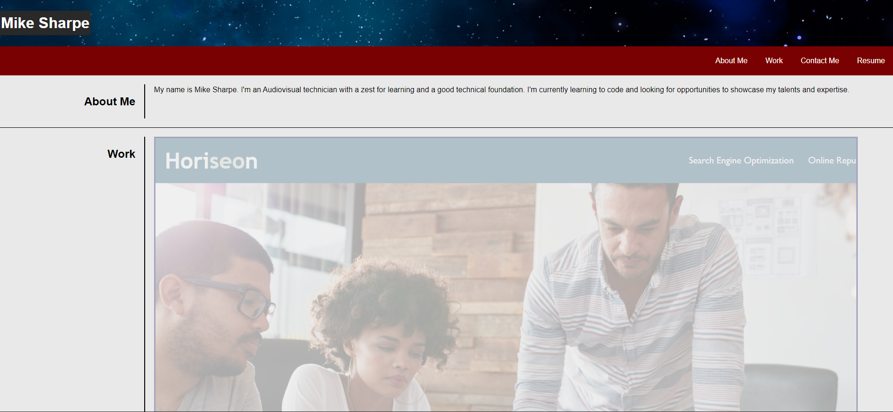

# Advanced CSS Portfolio Assignment

## Contents

* Introduction
* Details
* Screenshots of projects
* Completed results
* Next steps

## Overview
The website is to demonstrate a couple of things:
  * To establish practice and execution of HTML and CSS skills.
  * To make available my credentials to potential employers.

## Specifics

  * Fonts are kept basic for translating over multiple devices and browsers.
  * Color theme is minimal, as to practice the fundamentals.
  * The arrangement was mirrored according to a homework assignment in order to practice interpreting a design and replicating it.
  * Work section designed in a way to quickly communicate what the projects were and a brief visual to accompany it.
  * With Flex being used, screen resizing is responsive. There are some basic adjustments made, but more to come as more work is done over the course of the program.

## Screenshot

* Full Page

## Deployment of application
The link to the hosted project is here - [https://wild-things.github.io/My-Portfolio-Website/](Https://wild-things.github.io/My-Portfolio-Website/)

## Next steps

* The website will go through many iterations, largely with the purpose of website design practice 
* Javascript will be incorporated in the coming weeks.